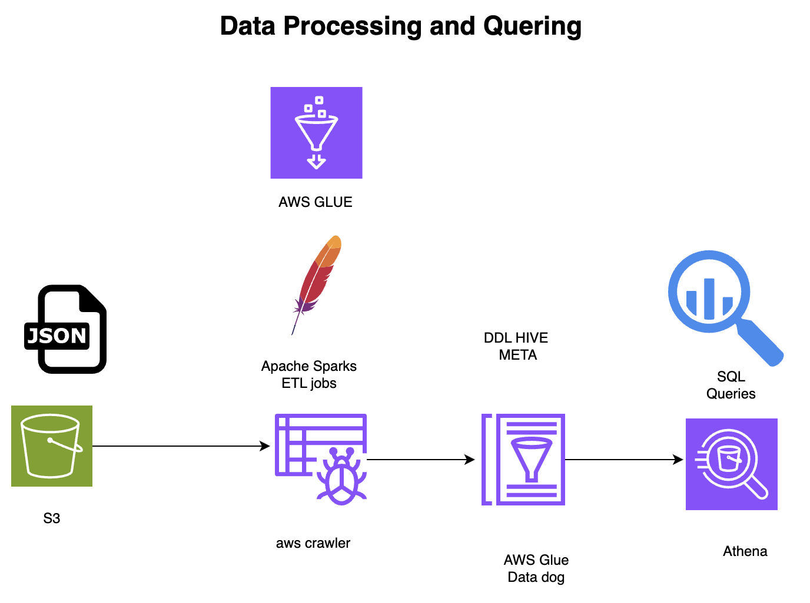

# Data_collection-day3-

## Project Description

**Project 3: Data Organization and Querying using GoLang and SDK v2**

In this project, I focused on developing a robust data organization and querying system utilizing the latest GoLang language and SDK v2. Leveraging my newfound skills in Golang, I successfully integrated the SDK v2 to create an efficient data management framework.

The project involved designing and implementing a comprehensive data organization system that enables seamless querying of data from a database. By utilizing the SDK v2, I was able to tap into its advanced features and functionality, resulting in a highly scalable and maintainable solution.

Key aspects of this project include:

- Utilizing GoLang as the programming language for development
- Leveraging the latest SDK v2 features for efficient data querying and organization
- Designing and implementing a robust data management framework
- Ensuring seamless integration with a database for efficient data retrieval

This project demonstrates my ability to learn and apply new technologies, such as Golang and SDK v2, to create a functional and efficient data organization system. The outcome of this project showcases my technical skills and problem-solving capabilities in the context of data management and querying.

## System Design



## Pre-requisites

- Go 1.20 or later
- AWS account with necessary permissions
- Environment variables set in a `.env` file

```properties
SPORTS_DATA_API_KEY=your_actual_api_key
NBA_ENDPOINT=https://api.sportsdata.io/v3/nba/scores/json/Players
```

## Getting Started

```
go run main.go
```
